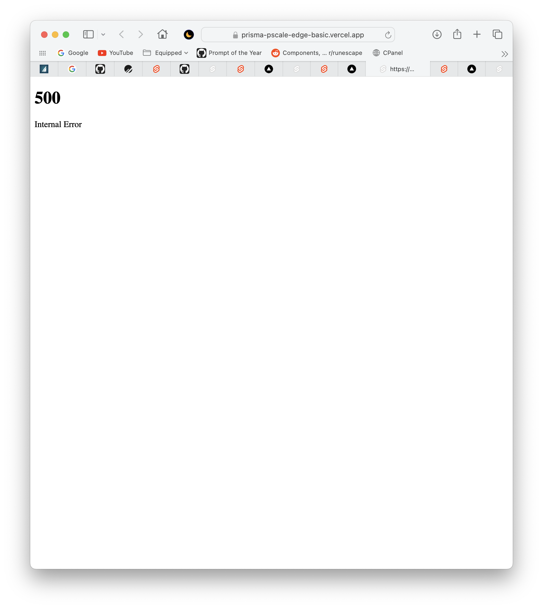
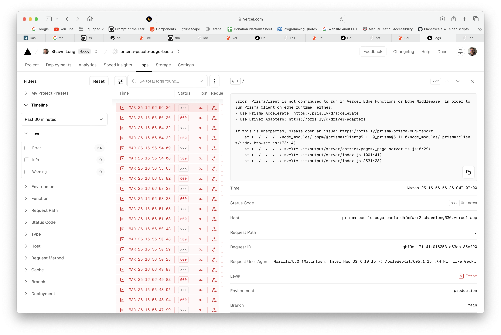

# Basic Prisma PlanetScale Vercel Edge Example

## Steps to Reproduce

1. Create a PlanetScale Database

2. Add `DATABASE_URL` to a .env file in project root

3. Install dependencies using `pnpm install`

4. Push schema changes to database

   ```bash
   prisma db push
   prisma generate
   ```

5. Start Local Dev Server

   ```bash
   pnpm build
   pnpm dev
   ```

6. Fork the repo to your own account

7. Import the forked-repo into vercel

8. View Deployment and Logs to see error

## Issue Description
 This is a basic application that demonstrates an issue with Prisma's new preview feature, driver adapters. You'll notice that this project works great in local development.


However, when vercel attempts to build and deploy the repo, it results in the following error:

>Error: PrismaClient is not configured to run in Vercel Edge Functions or Edge Middleware. In order to run Prisma Client on edge runtime, either: - Use Prisma Accelerate: https://pris.ly/d/accelerate - Use Driver Adapters: https://pris.ly/d/driver-adapters If this is unexpected, please open an issue: https://pris.ly/prisma-prisma-bug-report    at (../../../../node_modules/.pnpm/@prisma+client@5.11.0_prisma@5.11.0/node_modules/.prisma/client/index-browser.js:173:14)    at (../../../../.svelte-kit/output/server/entries/pages/_page.server.ts.js:8:29)    at (../../../../.svelte-kit/output/server/index.js:1001:41)    at (../../../../.svelte-kit/output/server/index.js:2531:23)





